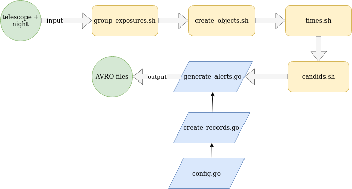
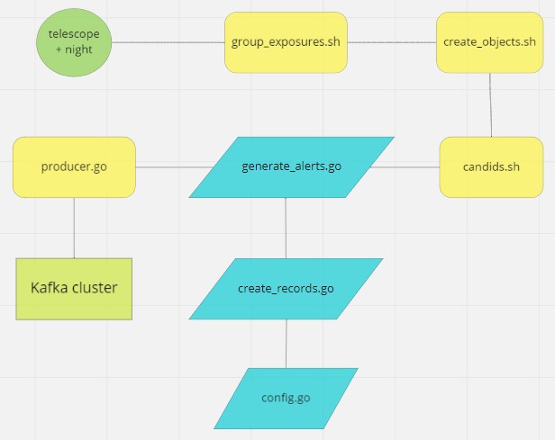

## ATLAS real-time stream

This repository contains the files of the first prototype of ATLAS real-time pipeline.
***

### General description

The ATLAS pipeline consists of several Bash and Golang concatenated scripts. The current version requires a telescope and night in the ATLAS format as input and creates the AVRO files of that telescope and night as a result.

#### Previous pipeline



#### Current pipeline



***
### Scripts

#### group_exposures.sh

For a given telescope and camera and a given night, group the exposures based on the corresponding tessellation.

The script receives two arguments: a telescope and camera and a night in the ATLAS format.

* **Telescope:** a telescope in ATLAS is `01` for Mauna Loa and `02` for Haleakala, the camera used should be always `a` (although this might change in the future.) Therefore, the first argument of the script should be either `01a` or `02a`.

* **Night:** a night is defined by a Modified Julian Day, e.g.: `58884`. There is more about this in the ATLAS Internal Site.

The output of this script is the file `<telescope><night>_img.groups`. The file contains one line per each tessellation and the data inside follows the pattern: `<tessellation> <exposure1> <exposure2> <exposure3> <exposure4>`, where the exposures are the ones corresponding to the tessellation and can be between 1 and 5 (usually 4).

E.g. `02a58884_img.groups`:
```
SV341N74 02a58884o031o 02a58884o056o 02a58884o057o 02a58884o099o
SV342N75 02a58884o044o 02a58884o049o 02a58884o101o 02a58884o102o
```

```
This script uses an associative array to hold the tessellation and exposures
info. The script considers the headers of the log file as regular info and,
therefore, it adds the headers to the associative array. Also, after a group of
exposure and tessellations is complete, the group is not deleted from the array.
None of these issues modify the expected behavior of the script, however, they
should be changed in order to have cleaner code.
```

#### create_objects.sh

For a given tessellation of a given night grab the associated exposures, find the ddc files and output a list of candidate transient objects as an ordered list of ATLAS detections grouped by RA and Dec within a given tolerance.

This script receives three arguments: a tessellation (e.g.: SV341N74), the  `<telescope><night>_img.groups` file and the tolerance in arcseconds (1.9 since the pixel size is 1.86").

The script creates a directory `tessellation_telnite` (e.g.: `SY070N61_02a58912`) for each of the tessellations. This directories contain the file `tessellation_telnite.objects`, and the `exposure_name.diff.head` files containing the header of each difference image of the given tessellation taken from the ddc files.

```
The current implementation of the pipeline passes the required three arguments
to this script when the <telescope><night>_img.groups right after the line which
contains the exposures associated with the requested tessellations is written,
and then the script proceeds to check if the line is in the file. This behavior
is inefficient and a remnant of a previous version of the pipeline and should be
replaced by one that simply receives the arguments and uses them.
```

The times.sh script grabs the time information from the objects and exposures files and computes the `mjd` of each object as the average mjd of the exposures where that object appears.
In the current pipeline, the times.sh script was merged into the create_objects.sh script for efficiency reasons.


#### candids.sh
This script compiles the information for candidates in a given `tessellation_telnite.objemjd` file and prepares the directories to translate to AVRO format. The candidates' information is stored in `.info` files.

#### config.go

Contains the configuration structure and loads the configuration file for the other Golang files.

#### create_records.go

Puts the candidate's info, its stamps and other fields together, so the data is ready to be converted to AVRO format.

#### generate_alerts.go

Takes all the `.info` files available in the input directory and creates an AVRO file for each of them.

#### utils.sh

Contains functions used by more than one of the scripts of the pipeline. More functions need to be added in order to simplify the code of the scripts.

#### producer.go

A Kafka producer written in Go.
